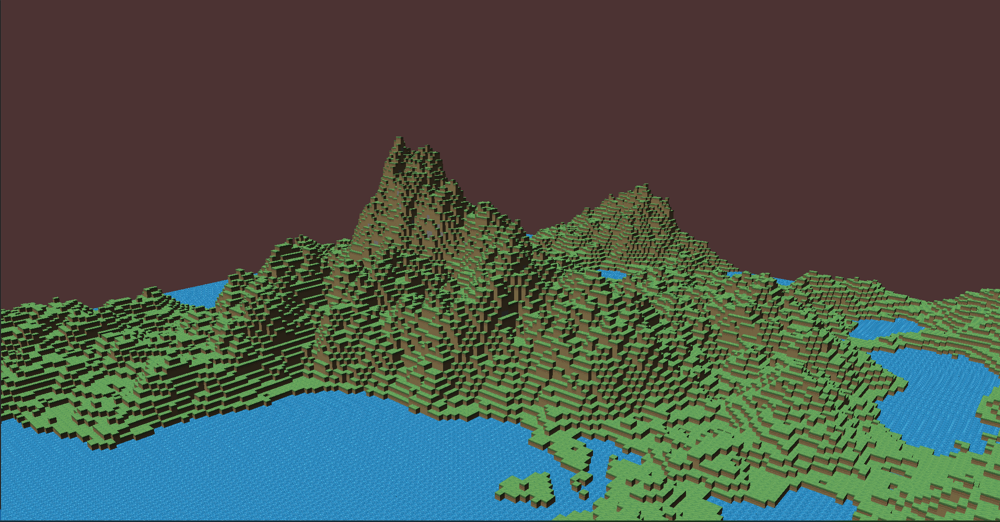

# Voxel Game From Scratch


Hello to whoever is reading this. This is a Voxel Game that is entirely made from GLFW and OpenGL. There are a lot of low-level graphics programming going on. 

## Run Guide

Clone Project

`git clone --recurse-submodules https://github.com/Mr-Anyone/VoxelGame.git `

To Build and compile the program:

```
mkdir build 
cd build
cmake ..
make -j 
./VoxelGame
```

Quicktip for vscode. Set the build target to VoxelGame (not ALL_BUILD) or else it would not work. 
